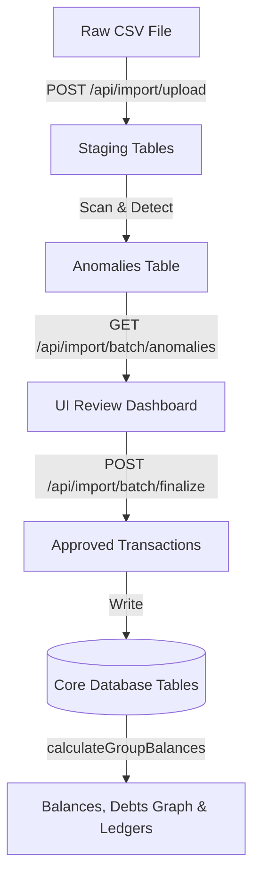

# FairShare — Shared Expenses App

A transparent, auditable, and explainable shared expense management system featuring a two-stage CSV import engine that scans, stages, and handles data anomalies and membership timelines.

---

## 🚀 Getting Started

Follow these steps to run the application locally:

### 1. Database Setup

1. Create a project in [Supabase](https://supabase.com).
2. Go to the **SQL Editor** in your Supabase dashboard.
3. Open and copy the contents of [supabase/schema.sql](file:///c:/Users/petri/Documents/1.Projects/spreetail_task/supabase/schema.sql).
4. Run the SQL script to create all tables (users, groups, persons, group memberships, expenses, participants, settlements, import batches, staged rows, anomalies) and insert seed data for the **Flatmates** group.

### 2. Environment Configuration

1. Create a `.env.local` file in the root directory.
2. Copy variables from [.env.example](file:///c:/Users/petri/Documents/1.Projects/spreetail_task/.env.example):
   ```env
   NEXT_PUBLIC_SUPABASE_URL="https://your-project.supabase.co"
   NEXT_PUBLIC_SUPABASE_PUBLISHABLE_KEY="your-publishable-key"

   NEXTAUTH_SECRET="random-string-here"
   NEXTAUTH_URL="http://localhost:3000"
   ```

### 3. Install & Run

1. Run `npm install` to download dependencies.
2. Run `npm run dev` to start the development server.
3. Open [http://localhost:3000](http://localhost:3000) in your browser.
4. Log in or create an account (e.g. name "Aisha" to link directly with seed members) and select the **Flatmates** group.

---

## 🛠️ Tech Stack

- **Framework:** Next.js 16 (App Router, TypeScript)
- **Styling:** Vanilla CSS & Tailwind CSS v4 (Custom Playful & Colorful UI language, no component libraries)
- **Database:** Supabase PostgreSQL (Direct `@supabase/supabase-js` client, no ORM)
- **Authentication:** NextAuth.js (Credentials Provider)

---

## 🏛️ Architecture Overview

The application separates data processing from live state calculations to guarantee auditability:



1. **Two-Stage CSV Import:** Ingests raw CSV data into staging tables (`imported_rows` and `anomalies`) first. Users review, edit details inline, and approve/reject before final commit to transactional tables (`expenses` and `settlements`).
2. **Pure Business Logic:**
   - [csvParser.ts](file:///c:/Users/petri/Documents/1.Projects/spreetail_task/src/lib/csvParser.ts) Normalizes dates, currency, amounts, and names, and detects 12+ categories of anomalies.
   - [balanceEngine.ts](file:///c:/Users/petri/Documents/1.Projects/spreetail_task/src/lib/balanceEngine.ts) Pure helper that computes net balances, simplified debt settlements (greedy path minimizer), and builds chronological ledgers.
3. **Session Guards:** Next.js middleware blocks unauthenticated traffic and redirects to `/login`.

---

## 📑 Project Documentation

- **Decision Log:** [docs/DECISIONS.md](file:///c:/Users/petri/Documents/1.Projects/spreetail_task/docs/DECISIONS.md) - Rationale for direct Supabase, NextAuth, and custom styling decisions.
- **Scope & Anomaly Policies:** [docs/SCOPE.md](file:///c:/Users/petri/Documents/1.Projects/spreetail_task/docs/SCOPE.md) - Exact anomaly categories, detection rules, and relational schemas.
- **AI Usage Summary:** [docs/AI_USAGE.md](file:///c:/Users/petri/Documents/1.Projects/spreetail_task/docs/AI_USAGE.md) - Tools, key prompts, and details on three specific AI errors corrected.
